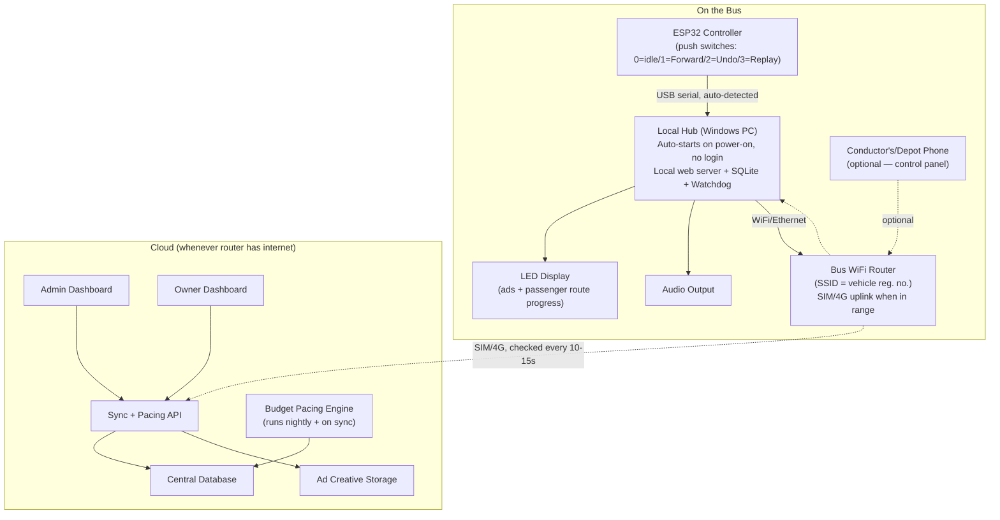
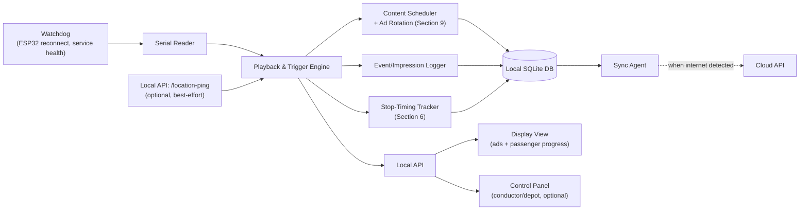

# AdKerala — Offline-First Bus Media System
## Technical Specification & Developer Build Guide (v2)

**Version:** 2.0 — expanded for reliability, admin tooling, ad budget pacing, passenger display, and simplified driver operation
**Prepared:** July 2026
**Scope:** On-bus hardware/software, admin dashboards, ad campaign & budget system, driver/conductor interaction, cloud sync, revenue reporting.

---

## 1. Design Philosophy — This Has to Work for People Who Never Touch a Computer

This section exists because it should shape every decision below, not just this document's tone.

- **Two input channels, both real, each with a clear job.** Physical push switches (Forward/Undo/Replay) are the primary, always-available way to drive stop sequencing — usable by feel, no screen needed. The phone control panel is used by **either the driver or the conductor** — both are present on every bus throughout the day — mainly to **start and end a trip**, plus corrections and admin. Confirmed: trip start/end is a deliberate phone action, not something the system guesses at (Section 4.2). Both people can also use the push switches. Design for either person picking up either input at any time, not a rigid "driver only does X" split.
- **The PC is never switched on or off by anyone.** It powers up with the vehicle, boots straight into working state with no login, and runs until the vehicle's power cuts out. Nobody manages the PC itself, ever — only the phone control panel and the push switches are touched day-to-day.
- **Every hardware/connectivity failure mode must be self-healing or invisible.** If the ESP32 disconnects and reappears on a different port, the software finds it again on its own. If the display crashes, it restarts itself. Nobody on the bus should ever see an error message they have no way to act on — real problems get surfaced to the depot/admin dashboard.
- **"Simple" beats "clever" everywhere in this spec.** Every added feature below (admin dashboards, ad budget pacing, passenger displays, timing analytics, audio composition) lives in the cloud/admin layer or is fully automatic on the bus — none of it adds a step for whoever's driving or conducting that day.

Everything that follows is written to satisfy these constraints, not just to add features on top of them.

---

## 2. System Architecture



**Key principle, unchanged from v1: the bus is the source of truth for what happened today; the cloud decides what should happen tomorrow.** The Hub never blocks on a network call, and now, critically, it never blocks on a human either.

---

## 3. Hardware Layer & Reliability

### 3.1 ESP32 ↔ Hub protocol (confirmed)

Single-signal serial line, 0–3, edge-triggered on state change, plus a heartbeat:

| Signal | Button | Hub action |
|---|---|---|
| `0` | — | Idle, no action |
| `1` | Forward | Advance to next stop, play announcement + ad, log |
| `2` | Undo | Revert to previous stop, cancel an in-progress announcement if one just started |
| `3` | Replay | Repeat current stop's announcement, no index change |

A heartbeat line (`HB,<uptime_ms>`, every 5s) runs alongside. Missing heartbeat for >15s = hardware fault, logged and surfaced to the depot dashboard — **never shown to the driver as an actionable error, since there's nothing they can do about it beyond what they're already doing (driving).**

### 3.2 ESP32 port resilience — "plug it into any port and it just works"

This is a first-class reliability requirement, not an afterthought:

1. **Never hardcode a COM port.** Identify the ESP32 by its USB Vendor ID / Product ID (VID/PID) using `serialport`'s `SerialPort.list()`, not by port number.
2. **Background scanner**: a watchdog process checks every ~5 seconds whether the expected device is present and its heartbeat is current. If the heartbeat goes stale, the scanner immediately re-lists all serial ports looking for a device matching the known VID/PID — including on a **different** COM port — and reconnects automatically.
3. **Zero action required from anyone.** If a cable gets bumped, re-plugged into a different USB socket, or the ESP32 browns out and reboots, the Hub finds it again within a few seconds on its own. This should be tested explicitly: unplug the ESP32 mid-operation, plug it into a different USB port, confirm the Hub reconnects without any restart.
4. During the reconnect gap, the Hub should **hold last known state** (current stop index, active trip) rather than resetting anything — a brief hardware hiccup should never lose trip progress.

### 3.3 Physical push switches (confirmed: readymade, already installed)

Switches are already sourced and installed in each bus — no hardware decision needed here. The software-side responsibility stays the same regardless: aggressive debounce and duplicate-press suppression (Section 4.5), since "already installed, harsh daily use" means the software has to be the layer that absorbs rough handling, not the switch itself.

### 3.4 Audio output (confirmed: single aux out) and location (unchanged reasoning)

**Audio**: single stereo aux output from the PC — one analog audio stream out, not multiple channels. This matters directly for Section 18 (Modular Audio Composition): "layering" announcements over music, or sequencing chime → stop name → sponsor snippet, is entirely a **software mixing/sequencing concern** — everything gets combined into one final stream before it reaches the aux jack. No hardware multi-channel mixing to design around.

**Location**: no dedicated GPS module, phone GPS as best-effort enrichment only — unchanged from the earlier reasoning. Since both driver and conductor may have the control panel open, whichever phone has the most recent ping is used; nothing about core operation depends on it either way.

### 3.5 Bus identity — preventing cross-connection at a busy bus stand

When several AdKerala buses sit at the same stand, their WiFi networks can overlap. The design must make it **structurally impossible** to log data against the wrong bus, and as easy as possible for a human to visually confirm they're on the right one:

1. **Each bus's WiFi router SSID includes the vehicle registration number** — e.g. `AdKerala-KL07AX1234` — printed on a sticker at the conductor's seat, so connecting to the wrong network is an obvious, visible mistake before it happens.
2. **The control panel's very first, largest element is the vehicle registration number and route number**, in big text, confirmed against the Hub's own provisioned identity — so anyone opening it on the wrong bus notices immediately.
3. **The real safeguard is server-side, not network-side**: each Hub PC is provisioned once with a unique device ID and API key tied permanently to one `bus_id` in the cloud database. Even in total network chaos — wrong WiFi, overlapping SSIDs, a phone connecting to the wrong router — **a given Hub can only ever sync data under its own bus's identity.** A network mixup can cause momentary visual confusion on a phone screen; it can never cause a play_log or revenue record to be written against the wrong bus. This guarantee matters far more than the SSID naming, which is just a human convenience layer on top of it.

---

## 4. The Local Hub — Offline-First, Fully Unattended

### 4.1 What runs automatically on boot

On power-on (ignition), with **zero human interaction**:
1. Windows auto-logs into a dedicated local account (no password prompt).
2. The Hub backend starts as a Windows service (survives crashes, auto-restarts — Section 3.2's watchdog logic lives here).
3. The Display View launches in a kiosk browser, full-screen, no window chrome.
4. The ESP32 serial reader connects (or begins scanning per 3.2).
5. The system is now live — the driver's first Forward press of the day just works.

### 4.2 Trip lifecycle — confirmed: started via phone, by whoever is present

**Confirmed design: trip start/end is a deliberate action on the phone control panel, done by either the driver or the conductor** — not auto-inferred. Both are on the bus throughout the day, and either can do this.

- **Start Trip / End Trip**: two large buttons on the control panel's main screen. Either person taps them. No PIN required for this specific action if a driver/conductor is already recognized as assigned to this bus for the day (see 7.1) — keep the actual tap itself as close to zero-friction as physically pressing a button.
- **Push switches (Forward/Undo/Replay) only do anything once a trip is active.** If a driver presses Forward before anyone has started a trip on the phone, the safest behavior is to treat it as **implicitly starting the trip anyway** — a driver who forgets the phone step shouldn't be blocked from working, but the trip record should note `started_via: button_fallback` so reporting can distinguish it from a properly declared start. This is a safety net, not the primary flow.
- **Idle auto-close remains as a safety net**, not the primary mechanism: if a trip is left open with no signal at all (button or phone) for a long threshold (e.g. 4+ hours), auto-close it so a forgotten "End Trip" tap doesn't leave a trip open overnight and corrupt the next day's data.
- **Multiple phones, one live state**: since both driver and conductor may have the control panel open on their own phones simultaneously, the Hub should push live state to **all** connected sessions (WebSocket, or short-poll every 2–3s as a simpler fallback) — if either person starts a trip, taps a correction, or the push switches advance a stop, both phones update immediately. There's no "locked to one session" — it's a shared live view, and the last action taken wins, since there's no scenario here where driver and conductor are working against each other rather than together.

### 4.3 Internal architecture



### 4.4 Local database (SQLite) — core tables, updated

| Table | Purpose | Key fields |
|---|---|---|
| `routes` | Known routes | `route_id`, `name`, `stops_json` (ordered) |
| `stops` | Stop metadata | `stop_id`, `name_ml`, `sequence_no` |
| `content_items` | Cached ads/announcements/music | `content_id`, `type`, `file_path`, `duration_sec`, `tier`, `advertiser_id`, `campaign_id`, `active_from`, `active_to` |
| `campaign_quotas` | **New** — this bus's daily play allowance per campaign, set by the cloud pacing engine | `campaign_id`, `date`, `plays_allotted`, `plays_used` |
| `playlists` | Scheduling rules | `playlist_id`, `route_id`, `rules_json` |
| `trips` | One row per auto-detected trip | `trip_id`, `route_id`, `start_time`, `end_time`, `current_stop_index`, `auto_closed` (bool), `synced` |
| `play_logs` | Every content play — the billing ledger | `log_id`, `trip_id`, `content_id`, `campaign_id`, `stop_id`, `played_at`, `duration_played_sec`, `lat`/`long` (nullable), `synced` |
| `stop_segment_timings` | **New** — actual duration between consecutive Forward presses | `route_id`, `from_stop_seq`, `to_stop_seq`, `trip_id`, `duration_sec`, `recorded_at` |
| `button_events` | Raw ESP32 signal log | `event_id`, `signal`, `timestamp` |
| `device_config` | This bus's identity | `bus_id`, `route_assigned`, `hardware_version`, `last_sync_at` |
| `sync_queue` | Outbox — unsynced records | `queue_id`, `table_name`, `row_id`, `attempts` |

Unchanged design principle: **append-only, `synced` flag, never delete before confirmed synced.**

### 4.5 Playback & trigger logic

```
on Control Panel "Start Trip" tap (driver or conductor, primary path):
    create new trip row, start_time=now, current_stop_index=0,
        started_via='phone'
    push updated state to all connected phone sessions (Section 4.2)

on Control Panel "End Trip" tap:
    close trip row, end_time=now
    push updated state to all connected phone sessions

on ESP32 signal == 1 (Forward):
    debounce: ignore if <2s since last Forward (protects against an
              over-eager double-press — a real failure mode with harsh use)
    if no active trip: start one anyway, started_via='button_fallback'
        (Section 4.2 — a safety net, not the primary flow)
    advance current_stop_index by 1 (bounded to route length)
    write stop_segment_timings entry: duration since previous Forward
    play the composed announcement for the new current_stop_index
        (chime + stop name + sponsor snippet if any — Section 18)
    select next screen ad via the rotation engine (Section 10), respecting
        today's campaign_quotas for this bus (Section 9)
    play screen ad, layered per content spec
    write play_log entry for both the announcement and the screen ad (synced=false)
    push updated state to all connected phone sessions + passenger display

on ESP32 signal == 2 (Undo):
    if current_stop_index > trip start: current_stop_index -= 1
    stop any announcement/ad still playing from the last Forward
    write button_event log entry — no play_log entry
    push updated state to all connected phone sessions

on ESP32 signal == 3 (Replay):
    replay the composed announcement for current current_stop_index only
    write play_log entry (it's still a real impression)

on idle timeout with zero signals at all, button or phone (safety net only):
    auto-close the open trip, flagged auto_closed=true, so reporting can
        tell it apart from a proper End Trip tap

on scheduler tick (~60s):
    if idle between stops and inventory allows:
        play a background/idle-slot ad per rotation rules
```

---

## 5. Passenger-Facing Display

**Confirmed display spec: Full HD (1920×1080), landscape.** The LED screen carries two things simultaneously, not just ads: **ad/announcement content**, and a persistent **route progress strip** — a simple horizontal list of stops (like a metro line map) showing:

- Previous 2–3 stops (checked off / grayed)
- **Current stop, highlighted**
- Next 3–4 upcoming stops
- Final destination, always visible at the end of the strip regardless of route length

This needs no GPS and no live connectivity — it's rendered entirely from `current_stop_index` against the known `stops_json` for the route, which the Hub already has locally. Recommend a persistent strip along the bottom (e.g. ~15-20% of the 1080px height) leaving the remaining landscape area for the main ad video, rather than alternating between two full-screen modes — a passenger should be able to check their stop at a glance without waiting for a screen to switch. Updated instantly on every Forward/Undo signal.

**Estimated time to next stop** (a "smart" addition, not just a static list): computed from `stop_segment_timings` history — see Section 6 — shown as "~4 min to next stop" alongside the progress strip. This is an estimate from historical patterns, not a live prediction, and should be labeled as approximate.

---

## 6. Stop-Timing Intelligence

Every Forward press is timestamped, so the system already knows, per route, how long each stop-to-stop segment actually takes — without any GPS.

- **Locally**: each Hub logs raw `stop_segment_timings` (duration since the previous Forward press, per segment, per trip).
- **Cloud-side, nightly batch**: aggregate across all buses on a route into rolling averages per segment, bucketed by day-of-week and time-of-day (a segment at 8am on a weekday is a different number than the same segment at 2pm) — stored as `route_segment_typical_durations`.
- **Synced back down** to every Hub running that route, so each bus can show a locally-computed "~X min to next stop" on the passenger display (Section 5) using the latest known typical durations, entirely offline.
- **Also surfaced on the Admin Dashboard** as an operational signal: a segment consistently running much longer than its historical average flags a likely traffic hotspot or route problem worth investigating — this is a side benefit of data you're already collecting for the passenger display, not extra instrumentation.

---

## 7. Driver & Conductor Interaction

Both roles are present on every bus throughout the day, and both can use either input method — this isn't a rigid split, it's shared control with each channel suited to a different moment:

- **Push switches** (Forward/Undo/Replay): usable by either person, by feel, no screen needed — the natural choice while the bus is moving.
- **Control panel** (phone, bus WiFi): used by either person to **start/end the trip** (Section 4.2), make corrections, mute, or report an issue — the natural choice when stopped, or for whoever isn't currently driving.

### 7.1 Control panel — screens

| Screen | Purpose |
|---|---|
| **Bus identity banner** (always visible, top of every screen) | Vehicle registration number + assigned route, large text — the anti-cross-connection safeguard from Section 3.5 |
| **Trip Dashboard** | Big **Start Trip / End Trip** buttons (the primary action — Section 4.2), current stop, ESP32 hardware ✓/✗, router internet ✓/✗, last sync time |
| **Correction / Jump to Stop** | Manually set current position if it drifts out of sync |
| **Mute / Volume** | Software-level audio control |
| **Report Issue** | Short form, queued locally, synced when online |

No login is required to view the identity banner and status (so anyone can glance and confirm they're on the right bus); a simple PIN — shared by whoever's assigned to that bus for the day, driver or conductor — is only needed for actions that change state (starting/ending a trip, corrections, mute). Keep this PIN step as close to frictionless as possible: this needs to work for people who find phone UIs unfamiliar, so a short numeric PIN on large keys, not an email/password flow.

### 7.2 Training footprint

For the push switches: "press this when you leave a stop, press this if you pressed that by mistake, press this to repeat the announcement." For the phone: "tap Start when you begin, tap End when you're done." That's the entire onboarding — anything more complex than this belongs in the admin/cloud layer, not in front of the people running the bus day to day.

---

## 8. Sync Engine

- **Confirmed**: the bus WiFi router carries its own SIM on a monthly data plan — so connectivity is realistically available on and off throughout the day, not just at the depot. Kerala's tree cover and rural dead zones still cause gaps, so the design remains built around short, unpredictable windows rather than assuming a long always-on connection.
- Connectivity checked every 10–15s via a cheap `GET /api/v1/ping`; the instant it succeeds, the sync queue drains immediately, billing-critical `play_logs` first.
- Stays connected and streams new records in near-real-time for as long as the connection holds, rather than one batch and back to idle.
- Resumable, idempotent (unique ID + upsert), safe against a connection cutting mid-transfer.
- Sync also downloads each bus's updated `campaign_quotas` (Section 9), audio segments — `stop_name`/`sponsor_snippet` clips (Section 11) — and `route_segment_typical_durations` (Section 6), alongside video/banner content and route data. Audio clips are small; prioritize them just after play_logs and before larger video downloads if bandwidth is limited in a short window.

---

## 9. Ad Campaign & Budget Pacing System

This is the core of "admin sets ads on a budget, and the system figures out how to run them."

### 9.1 Campaign setup (Admin Dashboard)

An admin creates a campaign with:
- Advertiser, creative (video/banner), duration
- **Targeting**: all buses / specific routes / specific stops / specific time windows (e.g. 7–10am only)
- **Tier eligibility**: rural / urban standard / urban women-premium (Section 9.4 of the Revenue Model)
- **Total budget (₹)** and a date range
- **Pacing mode**: *Even* (spread evenly across the whole date range — the sensible default) or *ASAP* (spend as fast as inventory allows, for a short-notice promotion)

### 9.2 How the budget turns into an actual play schedule

This has to work despite buses being offline most of the day — there's no live bidding system here, just a planning cycle:

1. **Nightly (and on-demand when a campaign is created), the cloud Pacing Engine computes**: `plays_remaining = floor((budget - spent_so_far) / rate_per_play)` — using the tier's per-second rate × creative duration from the Revenue Model.
2. It identifies the **eligible inventory**: which buses/routes/stops/time-windows match the campaign's targeting, and how many operating days remain.
3. For *Even* pacing, it divides `plays_remaining` across eligible buses and remaining days to produce a **daily quota per bus**: "Bus KL07AX1234 may play Campaign #42 up to 6 times today."
4. This quota is written to `campaign_quotas` and downloaded by each bus on its next sync.
5. The Hub's local Content Scheduler treats the quota as a hard cap — once used up for the day, that campaign stops appearing in rotation on that bus until the next day's quota arrives.
6. **Actuals sync back up**; the Pacing Engine reconciles real spend against budget and recomputes quotas accordingly — a campaign that's underperforming its quota (bus wasn't in service, e.g.) gets its unused plays redistributed to other eligible buses the next cycle; a campaign that's exhausted its budget is excluded going forward. Since the bus router carries its **own SIM with a monthly data plan** (confirmed — not depot-only WiFi), connectivity is realistically available many times a day, not just overnight — so the Pacing Engine can recompute quotas every few hours rather than strictly nightly, giving an extra safety margin on top of the rule below.

### 9.2a Hard rule: never overspend a campaign's budget

**This is a hard design constraint, not a best-effort target.** A bus owner can see how many times an ad played and will reasonably expect payment for every play they saw — so an accidental over-delivery isn't just a rounding error, it's real money AdKerala would owe without having collected it from the advertiser. Two safeguards, working together:

1. **Quotas are always rounded down, never up**, and recomputed conservatively — if a campaign's remaining budget covers 5.9 plays today, the quota is 5, not 6. A slightly under-delivered campaign (a small number of unused, harmless plays at the very end of its budget) is the acceptable failure mode; an over-delivered one is not.
2. **Every play is tagged `billable` or `non_billable` at the moment it's logged** — a play only counts as `billable` if it consumed real remaining quota from a paying campaign. Fallback/house/PSA content played because nothing else was eligible (Section 10, step 5) is always `non_billable`. **Owner revenue share is calculated only from `billable` plays**, so even in an edge case where a local clock drift or sync delay caused a play beyond what the cloud had already accounted for, it's structurally excluded from what the company owes — it never becomes a liability just because it happened.

### 9.2b Bus owner visibility: revenue value, not raw play count

To keep this airtight and avoid disputes, the Bus Owner Dashboard (Section 13) shows **revenue value (₹) as the primary, authoritative figure — not a raw play counter an owner could independently tally and invoice against.** This is a deliberate choice: a play count alone invites a "you played it 47 times, pay me for 47" conversation that may not match what was actually billable after quota/reconciliation rules are applied, while a reconciled ₹ figure is always correct by construction, since it's derived directly from billable plays only. Section 13 covers this in detail — treat it as the recommended default, with the final call on exactly what an owner sees being a business decision, not a technical one.

### 9.3 Admin Dashboard — campaign screens

| Screen | Purpose |
|---|---|
| **Campaign List** | All campaigns, status (active/paused/exhausted/scheduled), budget spent vs. total, at a glance |
| **New/Edit Campaign** | The setup fields from 9.1 |
| **Campaign Performance** | Plays delivered, spend to date, by-route/by-bus breakdown, pacing chart (planned vs. actual) |
| **Quota Preview** | Before saving, show the admin an estimate: "at this budget, expect ~X plays/day across Y buses" — so they can sanity-check a budget before committing |

---

## 10. Ad Rotation — So Passengers Don't See the Same Ad Every Time

The local Content Scheduler, when choosing what plays at a given stop/idle slot, follows this order:

1. Filter to content eligible for this bus's tier, route, stop, and current time window.
2. Filter to campaigns with quota remaining today (Section 9.2).
3. Apply **frequency capping**: exclude anything played within the last N minutes (configurable, default ~20).
4. From what's left, pick using **weighted round-robin**, not simple priority order — maintain a small local "recently played" queue and never repeat the same `content_id` twice in a row if any alternative is eligible.
5. If nothing is eligible (all capped out, no quota left), fall back to a house/PSA slot or just music — **never dead air, never a frozen screen.**

---

## 11. Modular Audio Composition — Stop-Specific Audio Without Overwriting the Core Announcement

This is how a stop's announcement is actually built, and how a stop-specific sponsor message gets inserted without ever touching the base recording.

### 11.1 The core idea: announcements are assembled, not recorded whole

Instead of one audio file per stop containing the entire announcement, each announcement is a **sequence of short audio segments**, concatenated by the Playback Engine into one continuous stream (matching the single-aux-output hardware — Section 3.4) so it sounds like one uninterrupted sentence to a passenger, even though it's built from separate files.

**Segment types (a local content library, distinct from screen ads):**

| Segment type | Example | Who manages it | How often it changes |
|---|---|---|---|
| `chime` | A short tone before any announcement | Fixed, set once | Rarely |
| `stop_name` | The Malayalam pronunciation of one specific stop's name | Admin, per stop | Only if a name was mispronounced or a stop is renamed |
| `sponsor_snippet` | "This stop brought to you by..." — a short sponsored clip tied to a specific stop | Admin, via Campaign Management (Section 9) | As often as campaigns change |
| `outro` | A short closing sound/transition | Fixed, set once | Rarely |

### 11.2 The composition rule — sponsor content is additive, never a replacement

**The default sequence for every stop is: `chime → stop_name → outro`.** This is the "usual audio message" and it is never removed or overwritten by anything else.

**When a sponsor snippet is assigned to a stop, it's inserted into the sequence — it does not replace `stop_name`:** `chime → stop_name → sponsor_snippet → outro`. The base announcement plays exactly as it always does; the sponsor content is purely additive. This is what makes stop-specific advertising possible without ever risking a passenger not hearing the actual stop name — the thing they actually need.

This composition template (which segment types, in what order, for a given stop) is itself just data — stored per-route or per-stop as `announcement_template` — so an admin can adjust the pattern later (e.g., a route that wants two sponsor slots) without any code change, only a content/config update.

### 11.3 Admin capabilities

- **Upload/replace a `stop_name` clip** for any stop — used for corrections (mispronunciation) or when a stop is renamed. This is a **route-level asset**: since the same route can be assigned to multiple buses (Section 12.3), updating a stop's audio here propagates to every bus running that route on next sync — never edited per-bus.
- **Upload a `sponsor_snippet`** and assign it to a specific stop (and a campaign/budget, so it's tracked as billable inventory exactly like a screen ad — see 11.4).
- **Preview the assembled sequence** before publishing — play `chime + stop_name + sponsor_snippet + outro` back-to-back in the admin UI so nobody discovers a bad splice (an awkward gap, a volume mismatch) only after it's live on a bus.

### 11.4 Sponsor audio snippets are billable inventory, same as screen ads

A stop-specific sponsor audio snippet is just another content type inside the Campaign & Budget Pacing System (Section 9) — it has a `campaign_id`, a rate (per play, since it's a fixed-duration clip rather than metered by second the way screen ads are), a daily quota, and it's logged in `play_logs` exactly like a screen ad play. This means **"put ads related to specific stops"** isn't a separate system from the budget pacing already designed — it's the same campaign/quota/reconciliation machinery, just with an audio segment instead of a video/banner as the creative.

### 11.5 Local playback mechanics

The Hub's local `content_items` table (Section 4.4) already covers this without a schema change — `type` simply includes `chime` / `stop_name` / `sponsor_snippet` / `outro` alongside `ad_video` / `ad_banner` / `music`. The Playback Engine, on a Forward signal, looks up this stop's `announcement_template`, resolves each segment to its current audio file, and plays them back-to-back with no gap — implementation-wise, either pre-concatenate into a single buffer at trip-load time (simplest, avoids any inter-clip gap) or queue and play sequentially with precise timing (more flexible if templates change mid-trip, slightly more room for a timing bug — **recommend pre-concatenation for reliability**, matching this document's overall bias toward simple and robust over clever).

---

## 12. Admin Dashboard — Full Spec

| Module | What it does |
|---|---|
| **Bus Management** | Add/edit/remove a bus: registration number, hardware device ID (provisioned per Hub PC), **route assignment (pick from existing routes — the same route can be assigned to any number of buses, Section 12.3)**, tier, linked owner |
| **Bus Owner Management** | Add/edit an owner, link one or more buses to them, set/edit revenue-share terms |
| **Route Management** | Add/edit a route; add, remove, and reorder stops within a route, each with a Malayalam name; set tier per route (or per stop-segment, if a route crosses from rural into a city center) |
| **Stop Audio Management** | Upload/replace the `stop_name` clip for any stop, upload/assign `sponsor_snippet` clips (Section 11), preview the assembled announcement before publishing |
| **Driver/Conductor Roster** | Add/edit driver and conductor records, assign to buses (used for the shared control panel PIN — Section 7.1) |
| **Campaign Management** | Section 9.3 — covers both screen ads and sponsor audio snippets (Section 11.4) |
| **Fleet Health** | Every bus, color-coded by last-sync recency (green <24h, yellow 24–72h, red >72h) — a red bus likely has a real problem worth a physical check; drill in to see recent trips, hardware faults, flagged issues |
| **Content Library** | Upload/manage screen-ad creatives and audio segments, tag tier, review flagged "inappropriate ad" reports |
| **Revenue Reconciliation** | Cross-check play_logs against campaign spend and owner payouts — the numbers that eventually match what's on the bus owner's monthly cheque (Section 13) |

### 12.3 One route, many buses — how updates propagate

A route is an independent entity; any number of buses can be assigned to the same `route_id` (Bus Management just picks from the existing route list rather than creating a new one each time). **Any edit to a route — reordering stops, renaming a stop, replacing its audio, adjusting tier — is made once and propagates to every bus currently assigned to that route on their next sync.** There is no per-bus copy of route data to keep in sync manually; the route is the single source of truth, and buses simply reference it.


---

## 13. Bus Owner Dashboard

A scoped, read-only view for a bus owner (or their linked buses if they own several). **Design follows the rule from 9.2b: revenue value is the primary figure; raw play counts are not the headline.**

- **Their revenue-share amount this month** (₹) — the primary number, front and center, matching exactly what's on their physical monthly cheque. This is calculated only from `billable` plays (Section 9.2a), so it's always correct by construction, never a number the company has to walk back.
- **A trend view** (this month vs. last, by day) so the owner can see the number is real and moving, without it being broken down into a raw tally they could independently invoice against.
- **Bus uptime/sync health** — simple enough to reassure an owner the system is actually working on their bus, without needing to understand any technical detail behind it.
- **Whether to also show a play count at all is a business call, not a technical one** — the system supports either choice cleanly since `play_logs` already has everything needed. If shown, label it clearly as an estimate ("~340 ad plays this month") separate from the revenue figure, never implying a 1:1 rate the owner could multiply out themselves — the ₹ figure should never be reverse-derivable into a dispute.

---

## 14. User Roles (updated)

| Role | Where they operate | Core needs |
|---|---|---|
| **Driver** | Push switches (primary) + control panel (phone, bus WiFi) | Forward/Undo/Replay by feel; can also start/end trip and correct via phone. Zero training beyond Section 7.2. |
| **Conductor** (present on every bus) | Push switches + control panel, same access as the driver | Same as driver — either person does either action, whoever's free to at that moment |
| **Bus Owner** | Owner Dashboard (cloud) | Revenue transparency (Section 12) |
| **Depot/Fleet Coordinator** | Admin Dashboard | Fleet health, roster management |
| **Content Manager** | Admin Dashboard | Creative + audio upload, tier tagging, compliance review (Sections 11, 18) |
| **Campaign/Ops Admin** | Admin Dashboard | Campaign setup and budget pacing oversight (Section 9) |
| **AdKerala Finance** | Admin Dashboard | Revenue reconciliation, owner payouts, government reporting |
| **Advertiser** (future phase) | Advertiser Portal, read-only | Not required for MVP/pilot |
| **System/DevOps** | Direct server access | Deployment, monitoring, incident response |

---

## 15. Non-Functional Requirements (updated, reliability-first)

| Requirement | Target |
|---|---|
| Driver-facing failure surface | **Zero.** Every fault (hardware, connectivity, sync) is either self-healing or surfaced only to the Admin Dashboard |
| ESP32 reconnection | Automatic, any USB port, within ~5-10 seconds of the device reappearing, with trip state preserved across the gap |
| Boot-to-operational | <60 seconds from power-on, with zero human interaction |
| Power resilience | Survives abrupt power loss without DB corruption (SQLite WAL mode) or losing trip progress |
| Duplicate/mistimed button presses | Debounced in firmware and software; a double-press within 2s is treated as one signal |
| Sync responsiveness | Connectivity detected within 10-15s; queue drains immediately on connect |
| Budget pacing accuracy | Daily-quota-based (not instantaneous) — a known, documented trade-off of offline-first operation, mitigated by conservative quota rounding and nightly reconciliation |
| Passenger display accuracy | Route progress is always exact (derived from confirmed stop index); ETA is always labeled as an estimate |
| Data integrity | play_logs never lost before sync confirms; append-only local writes throughout |
| Cross-bus data safety | Structurally guaranteed by per-device provisioned credentials (Section 3.5) — not just a network-level convention |

---

## 16. Recommended Technical Stack

| Layer | Recommendation |
|---|---|
| Local Hub OS | Windows 10/11, auto-logon, no login prompt |
| Local Hub backend | Node.js + Express + `serialport` (VID/PID-based device matching, not fixed COM ports) |
| Running as a service | `node-windows` or NSSM — auto-restart on crash |
| Local database | SQLite, WAL mode |
| Local frontend | Plain HTML/CSS/JS or Svelte/Preact — kept deliberately light |
| Kiosk display | Chrome/Edge `--kiosk`, launched at Windows startup, sleep/screen-timeout disabled |
| ESP32 firmware | Arduino/C++, event relay only (0/1/2/3) |
| Cloud backend | Node.js/Express or Django REST Framework |
| Cloud database | PostgreSQL |
| Pacing engine | A scheduled job (nightly + on-demand) within the cloud backend — no separate service needed at this scale |
| Content storage | S3-compatible object storage |
| Admin/Owner Dashboard frontend | React (or Django admin, extended, for a faster MVP) |
| Hosting | Any mainstream cloud, sized for low-frequency bursty sync from a few thousand devices — not high-throughput real-time traffic |

---

## 17. Phased Build Plan

**Phase 1 — Core Offline Loop, Zero-Touch Operation**
- ESP32 protocol + auto-reconnect watchdog (Section 3.2) — test explicitly by swapping USB ports mid-operation
- Auto-start Windows service, kiosk display, no login anywhere
- Phone-based trip start/end (Section 4.2) with button-fallback safety net, local playback engine, SQLite schema
- Multi-session live state (both driver's and conductor's phones staying in sync)
- Passenger route-progress strip on the FullHD display (Section 5)

**Phase 2 — Sync + Basic Admin**
- Sync engine (Section 8), cloud backend, PostgreSQL schema
- Admin Dashboard: Bus, Bus Owner, Route/Stop management, one-route-to-many-buses (Section 12)
- Modular audio composition (Section 11): segment library, template engine, admin upload/preview
- Fleet health monitoring

**Phase 3 — Ad Campaigns & Revenue**
- Campaign management + Budget Pacing Engine, including the never-overspend rule and billable/non-billable tracking (Section 9)
- Ad rotation logic (Section 10), sponsor audio snippets as billable inventory (Section 11.4)
- Bus Owner Dashboard with revenue-first display (Section 13), revenue reconciliation

**Phase 4 — Intelligence & Scale**
- Stop-timing analytics (Section 6), ETA on passenger display
- Multi-bus provisioning workflow, OTA updates for Hub software
- Advertiser Portal (if/when needed)

---

## 18. Open Questions for the Developer Kickoff

1. Test the ESP32 auto-reconnect behavior physically (Section 3.2) before considering it done — unplug mid-operation, replug into a different USB port, confirm recovery within seconds with trip state intact. This is the single most safety-critical reliability feature in the whole spec.
2. Confirm the idle-timeout threshold for the trip auto-close safety net (Section 4.2) — a starting proposal (e.g. 4h), not a tested number.
3. Confirm the shared PIN design for the control panel (Section 7.1) — one PIN per bus per day, or per-person PINs? Affects the roster data model and how quickly onboarding actually goes in practice.
4. Test the multi-session live-update mechanism (Section 4.2 — WebSocket vs. short-poll) with two phones open simultaneously before relying on it; confirm it holds up over the bus router's WiFi specifically, not just on a desk.
5. Decide the campaign quota rounding aggressiveness (Section 9.2a) — how conservative to be trades off "never overspend" against "never under-deliver a paid campaign." Needs a number, not just a principle.
6. Confirm the final call on Bus Owner Dashboard visibility (Section 13) — revenue value only, or revenue value plus a labeled estimated play count. Recommended default given, but this is a trust/business decision as much as a technical one.
7. Decide the announcement composition default template (Section 11.2) — confirm `chime → stop_name → sponsor_snippet → outro` is the right order and the right set of fixed segments before content gets recorded against it, since changing the template later means re-auditioning every stop's assembled sequence.
8. Confirm whether the display's route-progress strip and the ad video content share the same FullHD 1920×1080 landscape canvas as a persistent split, or alternate on a timer — affects the frontend layout work directly.

---

*This document is a build specification, not a finished design — treat every number, threshold, and table name here as a strong starting proposal for the developer to confirm or push back on, not a locked contract.*
